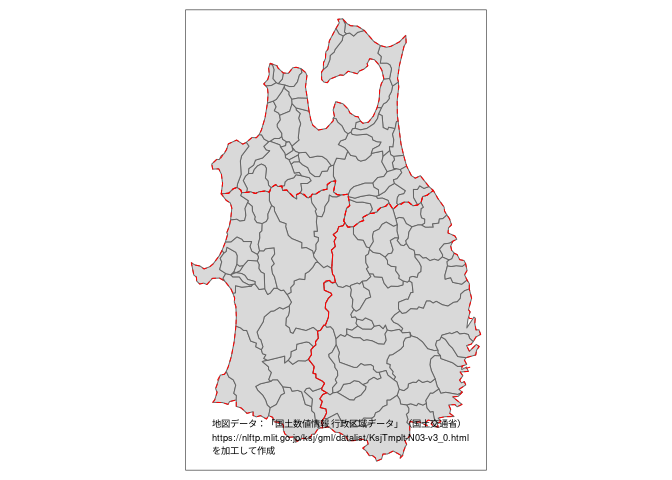

<!-- README.md is generated from README.Rmd. Please edit that file -->

# jisx0402

> Datasets Related to ‘JIS X 0402:2020’

<!-- badges: start -->

[](https://lifecycle.r-lib.org/articles/stages.html#experimental)
<!-- badges: end -->

## Overview

「全国地方公共団体コード」と国内の行政区域の地図データセットを扱うRパッケージです。

## Installation

``` r
# install.packages("jisx0402", repos = c("https://paithiov909.r-universe.dev", "https://cloud.r-project.org"))
remotes::install_github("paithiov909/jisx0402")
```

## Examples

### municipality

`municipality`は、日本にある行政区域名とその市区町村コードの一覧です。

総務省では、都道府県コード（JIS X 0401）と市区町村コード（JIS X
0402）とを組み合わせた数字を[全国地方公共団体コード](https://www.soumu.go.jp/denshijiti/code.html)として定めています（このほかに「一部事務組合等コード」も全国地方公共団体コードに含まれますが、そちらはこのパッケージでは探せません）。

``` r
jisx0402::municipality
#> # A tibble: 4,542 × 6
#>    pref_code city_code name           kana_name$half_upper start_date end_date
#>    <chr>     <chr>     <chr>          <chr>                <date>     <date>  
#>  1 01        100       札幌市         ｻﾂﾎﾟﾛｼ               1972-04-01 NA      
#>  2 01        101       札幌市　中央区 ｻﾂﾎﾟﾛｼ ﾁﾕｳｵｳｸ        1972-04-01 NA      
#>  3 01        102       札幌市　北区   ｻﾂﾎﾟﾛｼ ｷﾀｸ           1972-04-01 NA      
#>  4 01        103       札幌市　東区   ｻﾂﾎﾟﾛｼ ﾋｶﾞｼｸ         1972-04-01 NA      
#>  5 01        104       札幌市　白石区 ｻﾂﾎﾟﾛｼ ｼﾛｲｼｸ         1972-04-01 NA      
#>  6 01        105       札幌市　豊平区 ｻﾂﾎﾟﾛｼ ﾄﾖﾋﾗｸ         1972-04-01 NA      
#>  7 01        106       札幌市　南区   ｻﾂﾎﾟﾛｼ ﾐﾅﾐｸ          1972-04-01 NA      
#>  8 01        107       札幌市　西区   ｻﾂﾎﾟﾛｼ ﾆｼｸ           1972-04-01 NA      
#>  9 01        108       札幌市　厚別区 ｻﾂﾎﾟﾛｼ ｱﾂﾍﾞﾂｸ        1989-11-06 NA      
#> 10 01        109       札幌市　手稲区 ｻﾂﾎﾟﾛｼ ﾃｲﾈｸ          1989-11-06 NA      
#> # ℹ 4,532 more rows
#> # ℹ 1 more variable: kana_name$full_lower <chr>
```

全国地方公共団体コードは、５～６桁からなる数字の組です。６桁目はチェックデジットで、実際のコードとしては`pref_code`と`city_code`を連結した５桁になります。

``` r
jisx0402::municipality |>
  dplyr::filter(
    pref_code == "05",
    is.na(lubridate::as_date(end_date)) # 現存する自治体
  ) |>
  dplyr::mutate(
    muni_code = paste0(pref_code, city_code),
    muni_code_with_cd = paste0(muni_code, jisx0402::check_digit(muni_code))
  ) |>
  dplyr::select(muni_code, muni_code_with_cd, name)
#> # A tibble: 31 × 3
#>    muni_code muni_code_with_cd name      
#>    <chr>     <chr>             <chr>     
#>  1 05201     052019            秋田市    
#>  2 05202     052027            能代市    
#>  3 05203     052035            横手市    
#>  4 05204     052043            大館市    
#>  5 05206     052060            男鹿市    
#>  6 05207     052078            湯沢市    
#>  7 05209     052094            鹿角市    
#>  8 05210     052108            由利本荘市
#>  9 05211     052116            潟上市    
#> 10 05212     052124            大仙市    
#> # ℹ 21 more rows
```

なお、この一覧中には含まれていませんが、行政区域としての都道府県そのものは`city_code`を`000`として同様の方法で表示します。

### jpprefs

`jpprefs`は都道府県コードの一覧です。英語表記などがほしい場合には`zipangu::jpnprefs`を利用してください。

``` r
jisx0402::jpprefs
#> # A tibble: 47 × 2
#>    pref_code name  
#>    <chr>     <chr> 
#>  1 01        北海道
#>  2 02        青森県
#>  3 03        岩手県
#>  4 04        宮城県
#>  5 05        秋田県
#>  6 06        山形県
#>  7 07        福島県
#>  8 08        茨城県
#>  9 09        栃木県
#> 10 10        群馬県
#> # ℹ 37 more rows
```

### jpaddresses

`jpaddresses`は、Geoloniaが公開している[住所データ](https://github.com/geolonia/japanese-addresses)を元に加工したデータセットです。

``` r
jisx0402::jpaddresses
#> # A tibble: 277,656 × 6
#>    muni_code address_name   address_name_kana address_name_en   lat   lng
#>    <chr>     <chr>          <chr>             <chr>           <dbl> <dbl>
#>  1 01101     旭ケ丘一丁目   アサヒガオカ 1    ASAHIGAOKA 1     43.0  141.
#>  2 01101     旭ケ丘二丁目   アサヒガオカ 2    ASAHIGAOKA 2     43.0  141.
#>  3 01101     旭ケ丘三丁目   アサヒガオカ 3    ASAHIGAOKA 3     43.0  141.
#>  4 01101     旭ケ丘四丁目   アサヒガオカ 4    ASAHIGAOKA 4     43.0  141.
#>  5 01101     旭ケ丘五丁目   アサヒガオカ 5    ASAHIGAOKA 5     43.0  141.
#>  6 01101     旭ケ丘六丁目   アサヒガオカ 6    ASAHIGAOKA 6     43.0  141.
#>  7 01101     大通西一丁目   オオドオリニシ 1  ODORINISHI 1     43.1  141.
#>  8 01101     大通西十丁目   オオドオリニシ 10 ODORINISHI 10    43.1  141.
#>  9 01101     大通西十一丁目 オオドオリニシ 11 ODORINISHI 11    43.1  141.
#> 10 01101     大通西十二丁目 オオドオリニシ 12 ODORINISHI 12    43.1  141.
#> # ℹ 277,646 more rows
```

### jptopography

`jptopography()`は、日本の行政区域の地図データを`sf`オブジェクトとして返す関数です。`muni_code`は国土交通省が[行政区域コード](https://nlftp.mlit.go.jp/ksj/gml/codelist/AdminiBoundary_CD.xlsx)として公開しているもので、全国地方公共団体コードと同じ番号になります。

この関数で返されるデータは、スマートニュースが公開している[市区町村・選挙区
地形データ](https://github.com/smartnews-smri/japan-topography)を元に、FlatGeobuf
(`.fgb`) ファイルに加工したものです。

元データが「国土数値情報
行政区域データ」として公開されているもの（[第3.0版](https://nlftp.mlit.go.jp/ksj/gml/datalist/KsjTmplt-N03-v3_0.html)）を簡素化したデータであるため、この関数で返されるデータを利用する際には、国土交通省の指示するクレジット記載が必要になります。詳しくは[国土数値情報ダウンロードサイト](https://nlftp.mlit.go.jp/)の利用規約を参照してください。

``` r
northern_tohoku <-
  with(
    jisx0402::jpprefs,
    subset(pref_code, name %in% c("青森県", "秋田県", "岩手県"))
  )

jisx0402::jptopography("designated") |>
  dplyr::mutate(pref_code = stringr::str_sub(muni_code, 1, 2)) |>
  dplyr::filter(
    pref_code %in% northern_tohoku
  ) |>
  tmap::tm_shape() +
  tmap::tm_polygons() +
  tmap::tm_shape(subset(jptopography("prefecture"), pref_code %in% northern_tohoku)) +
  tmap::tm_borders(col = "red", lty = 2) +
  tmap::tm_credits(
    paste("地図データ：「国土数値情報 行政区域データ」（国土交通省）",
          "https://nlftp.mlit.go.jp/ksj/gml/datalist/KsjTmplt-N03-v3_0.html",
          "を加工して作成",
          sep = "\n")
  )
#> The legacy packages maptools, rgdal, and rgeos, underpinning the sp package,
#> which was just loaded, will retire in October 2023.
#> Please refer to R-spatial evolution reports for details, especially
#> https://r-spatial.org/r/2023/05/15/evolution4.html.
#> It may be desirable to make the sf package available;
#> package maintainers should consider adding sf to Suggests:.
#> The sp package is now running under evolution status 2
#>      (status 2 uses the sf package in place of rgdal)
```


